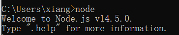
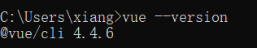

# MOVIE-REVIEW
------------------------


## Environment

### NodeJs

1. [Download | Node.js](https://nodejs.org/en/download/)

2. Unzip the binary package.

3. Check if node is installed.

   

4. Open the command window as administrator and set the cache folder.

5. Set the global module storage path.

6. Environment Configuration


### webpack

Installing webpack-cli dependencies

```
npm install webpack webpack-cli -g
```


### Vue

Global installation of vue-cli

```
npm install --global vue-cli
```

check version




## Configuration

```js
assetsSubDirectory: 'static',
assetsPublicPath: '/',
proxyTable: {
    '/api': {
      target: 'http://localhost:9090', //back-end
      secure: false,
      //changeOrigin: the proxy will transform request to the intended target server.
      changeOrigin: true,
    }
},

// Various Dev Server settings
host: 'localhost', // can be overwritten by process.env.HOST
port: 9999, // can be overwritten by process.env.PORT, if port is in use, a free one will be determined
```


## TECH

vue2 + vuex + vue-router + webpack + ES6/7 + axios + elementUI + iconfont


## Structure

------------------------

```bash
├── /build/ # Project build (webpack)-related configuration
├── /config/ # Project development environment configuration
├── /src/ # Source code directory
│ ├── /api/ # Requests
│ ├── /assets/ # Component static resources (images)
│ ├── /components/ # Public components
| ├── /api/ # Request interface
│ ├── /router/ # Router configuration
│ ├── /vuex/ # vuex state management
│ ├── /views/ # Route component (page dimension)
│ ├── /config/ # Interface configuration file (request address)
│ ├── App.vue # Component entry
│ └── main.js # Program entry
├── /static/ # Non-component static resources
├── .babelrc # ES6 syntax compilation configuration
├── .editorconfig # Define code format
├── .eslintignore # ES6 specification ignore file
├── .eslintrc.js # ES6 syntax specification configuration
├── .gitignore # git ignore files
├── index.html # page entry
├── package.json # Project dependencies
└── README.md # Project documentation
```


## Run

------------------------

``` bash
# install dependencies
npm install

# serve with hot reload at localhost
npm run dev

# build for production with minification
npm run build
```


